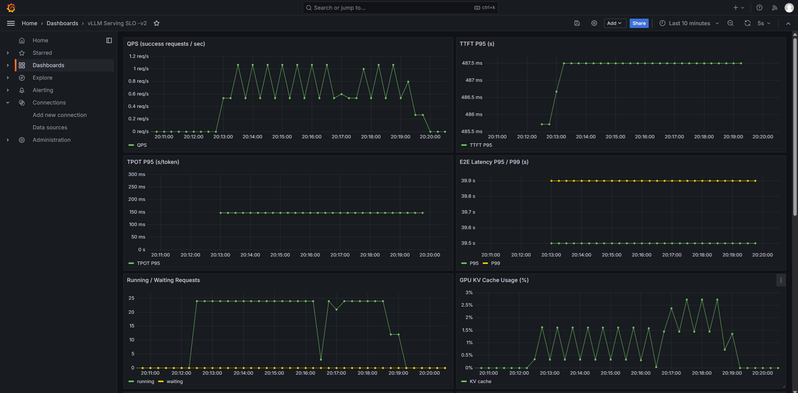
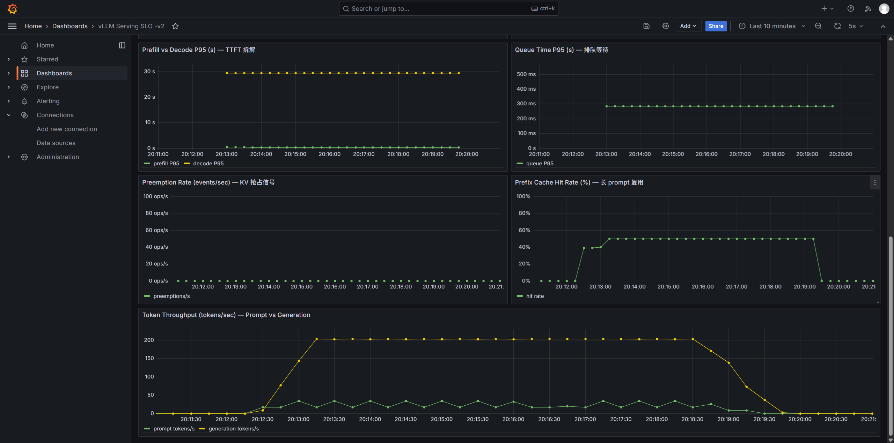

# LLM Serving Stack — 端到端 LLM 推理服务建设与性能优化

> 在 8×NVIDIA A30 (24GB, PCIe-only, 无 NVLink) 实验环境上从零搭建的 LLM 推理服务，
> 围绕 **K8s 部署、可观测性、张量并行、压力测试与瓶颈定位**展开的迭代项目。

## 项目目标

构建一套生产风格的 LLM 推理服务，覆盖：
- 容器化部署与 GPU 调度
- 全链路可观测性（TTFT / TPOT / Throughput / Queue / KV Cache / GPU 利用率）
- 多卡张量并行下的吞吐与延迟分析
- 长 prefill 干扰短请求的 P95 抖动归因
- 推理调度参数与拓扑优化方案对照
- 弹性扩缩容

## 版本路线图

| 版本 | 主题 | 状态 |
|------|------|------|
| V0 | 单卡 vLLM 推理基线 | ✅ |
| V1 | Kubernetes 部署（kubeadm + Calico CNI + NVIDIA Device Plugin） | ✅ |
| V2 | 可观测性体系（Prometheus + Grafana + SLO 面板） | ✅ |
| V3 | 多卡张量并行 scaling 实测（TP=1/2/4，含拓扑对照） | ✅ 数据完成，文档化中 |
| V4 | 混合负载压测与 P95 抖动归因 | 🟡 进行中（T1-Q1/Q2 完成） |
| V5 | 优化方案对照（chunked prefill / 调度参数 / PD 可行性） | 📋 |
| V6 | HPA 弹性扩缩容 | 📋 |

## 已完成版本要点

### V1 — Kubernetes 部署

- kubeadm 装单节点 K8s v1.31.14 + Calico CNI（Pod CIDR `10.244.0.0/16`）
- containerd 配 nvidia runtime + NVIDIA Device Plugin
- 用 `NVIDIA_VISIBLE_DEVICES` 显式限制 device plugin 的 GPU 视野，避免与裸 docker GPU 容器冲突
- Pod / Service / Deployment 三件套实操：自愈、扩缩容、滚动升级、回滚
- vLLM Pod (Qwen2.5-7B-AWQ) + NodePort Service 端到端推理验证

详见 [docs/v1-k8s.md](docs/v1-k8s.md)，YAML 在 [deploy/vllm/](deploy/vllm/)。

### V2 — 可观测性体系（Prometheus + Grafana + SLO 面板）

在 K8s 集群内部署 Prometheus + Grafana，基于 vLLM `/metrics` 端点构建 11 个核心 panel 的 SLO 仪表板，覆盖从基础 SLI 到 LLM 推理专属指标的完整链路。

**Dashboard 11 panel 设计：**

| 类别 | Panel | 关键 PromQL |
|------|-------|-------------|
| **基础 SLI** | QPS / TTFT P95 / TPOT P95 / E2E P95+P99 | `histogram_quantile` over vLLM histogram metrics |
| **调度状态** | Running / Waiting Requests | `vllm:num_requests_running`、`_waiting` |
| **资源** | KV Cache Usage | `vllm:kv_cache_usage_perc` |
| **LLM 专属** | Prefill vs Decode P95 | `request_prefill_time` / `request_decode_time` 分段 |
| | Queue Time P95 | `request_queue_time_seconds` — 容量瓶颈信号 |
| | Preemption Rate | `rate(vllm:num_preemptions_total)` — KV 抢占红线 |
| | Prefix Cache Hit Rate | `prefix_cache_hits / prefix_cache_queries` |
| | Token Throughput | `prompt_tokens` vs `generation_tokens` 拆解 |

**验证压测（Qwen2.5-7B-AWQ, 24 并发 × 300 请求 × max_tokens=256）：**

- Sustained generation throughput **200 tokens/s**（A30 单卡 + 24 并发）
- Decode-bound 工作负载：prefill ≈ 0s（prefix cache 加速）+ decode ≈ 30s 主导 E2E ~40s
- KV cache 仅 1.5%，preemption=0 — 当前瓶颈是 GPU 算力分摊而非显存
- TPOT P95 = 150 ms/token，呈现 decode 阶段 memory-bound 的典型并发摊薄行为

**截图：**

基础 6 panel（QPS / TTFT / TPOT / E2E / Running-Waiting / KV Cache）：



进阶 5 panel（Prefill-Decode 拆解 / Queue Time / Preemption / Prefix Cache / Token Throughput）：



部署 manifest：[deploy/monitoring/](deploy/monitoring/)（Prometheus + Grafana + Dashboard JSON）

### V3 — Tensor Parallel Scaling 实测

在 PCIe-only 拓扑下对 Qwen2.5-7B (BF16) 跑 TP=1/2/4 对照实验：

| 配置 | GPUs | req/s | TPOT P50 | TPOT P95 |
|------|------|------:|---------:|---------:|
| TP=1 | 4 | 14.45 | 23.6 ms | 401 ms |
| TP=2 PIX | 4,5 | 18.15 | 17.1 ms | 295 ms |
| TP=2 PHB | 2,4 | 17.62 | 17.2 ms | 295 ms |
| TP=4 PIX | 4-7 | 14.89 | 14.6 ms | **421 ms** |

**核心发现：**

1. **Decode TPOT scaling**：TP=2 提升 1.38×、TP=4 提升 1.62× — 子线性，受限于每层 all-reduce
2. **拓扑对照（TP=2）**：同 PCIe switch (PIX) vs 跨 host bridge (PHB) 仅差 ~3% — 7B 单 token AR 数据量约 230 KB/step，未打满 host bridge 链路
3. **TP=4 在 PCIe + 短输出场景下净亏损**：wall-time req/s 反而比 TP=2 慢 18%，all-reduce 开销吞掉计算并行收益；TPOT P95 从 295ms 退化到 421ms

数据：[benchmark/results/v3-tp-scaling/](benchmark/results/v3-tp-scaling/) ｜ 详细分析：[docs/v3-tp-scaling.md](docs/v3-tp-scaling.md)（写作中）

## 技术栈

- **推理引擎**：vLLM (BF16 / AWQ)，对照 SGLang
- **编排**：Kubernetes 1.31 (kubeadm) · Calico CNI · containerd · NVIDIA Device Plugin
- **可观测性**：Prometheus · Grafana · vLLM `/metrics` · `nvidia-smi dmon`
- **压测**：自研基于 OpenAI streaming API 的并发压测客户端
- **硬件**：8×NVIDIA A30 (24GB HBM2, PCIe Gen4, 无 NVLink)

## 仓库结构

```
llm-serving-stack/
├── docs/                 # 各版本独立文档
│   └── v1-k8s.md
├── deploy/               # K8s YAML
│   └── vllm/
├── benchmark/            # 压测脚本 + 结果数据
│   ├── *.py              # 并发压测、监控、KV 传输微基准等
│   └── results/
│       └── v3-tp-scaling/
└── notes/                # 学习笔记与源码精读
    ├── vllm/             # vLLM 源码与 scheduler 笔记
    ├── sglang/
    ├── disaggregated-prefill/
    ├── gpu-basics/
    ├── inference-optimizations/
    └── reports/          # 实验记录与案例研究
```

## License

[MIT](LICENSE)
